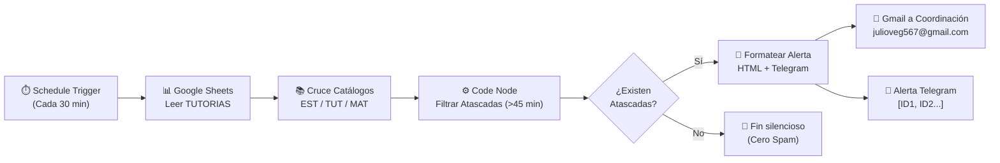

# 🎓 TutorBot — Sistema de Gestión y Alerta de Tutorías Académicas

<div align="center">

[](https://n8n.io)
[](https://n8n.io)
[](mailto:julioveg567@gmail.com)
[](https://core.telegram.org/bots/api)
[](https://developers.google.com/sheets/api)
[](https://developer.mozilla.org/es/docs/Web/JavaScript)
[](LICENSE)

**Monitoreo proactivo de estados olvidados, cron triggers deterministas y orquestación integral de tutorías con n8n.**

[Update: Examen](#-update-examen--alerta-de-tutorías-atascadas-sin-confirmar) •
[Arquitectura](#-arquitectura-del-sistema) •
[Workflows n8n](#-desglose-exhaustivo-de-los-workflows) •
[Base de Datos](#-estructura-de-la-base-de-datos-google-sheets) •
[Evidencias de Entrega](#-evidencias-y-capturas-de-pantalla) •
[Instalación](#-guía-de-instalación-y-puesta-en-marcha)

</div>

---

> [!IMPORTANT]
> ## 🚀 Update: Examen — Alerta de Tutorías Atascadas (Sin Confirmar)
> 
> **Enfoque evaluado:** Triggers temporales recurrentes (Cron), inspección de marcas de tiempo en bases de datos y gestión de estados olvidados.
> 
> ### 📋 Contexto y Problemática
> En el flujo regular de TutorBot, cuando un estudiante solicita una tutoría disponible, el sistema crea el registro en estado **`Asignada`** y notifica al tutor asignado. Sin embargo, en la operación real, existen escenarios donde ni el tutor ni el estudiante confirman o inician oportunamente la cita, provocando que la sesión quede en un estado de limbo durante horas o días, reteniendo la franja horaria sin ser aprovechada por otros alumnos.
> 
> ### 🎯 Objetivo del Examen
> Diseñar e implementar un **flujo independiente en n8n** que opere como un agente supervisor:
> 1. Despertar automáticamente mediante un **`Schedule Trigger` cada 30 minutos**.
> 2. Leer la hoja relacional **`TUTORIAS`** y filtrar aquellas sesiones que cumplan simultáneamente:
>    - Estado actual: **`Asignada`**.
>    - Tiempo de creación / asignación: **Mayor a 45 minutos** con respecto a la hora actual.
> 3. Enviar una alerta consolidada a **Coordinación Académica** mediante **Correo Electrónico (`julioveg567@gmail.com`)** y canal **Telegram**.

---

### ⚙️ Lógica Implementada y Algoritmo de Detección



#### 1. Cálculo Temporal Riguroso
Dado el instante de ejecución $T_{\text{ahora}}$ obtenido del runtime de JavaScript (`Date.now()`), se toma la marca de tiempo de referencia $T_{\text{ref}}$ registrada en formato ISO en la columna `fecha_asignacion` (o fallback a `fecha_solicitud`):

$$\Delta t = \frac{T_{\text{ahora}} - T_{\text{ref}}}{60\,000 \text{ ms/min}}$$

La tutoría califica como **atascada** si y solo si:

$$\text{estado} = \text{"Asignada"} \quad \land \quad \Delta t > 45 \text{ minutos}$$

#### 2. Mensaje Sugerido e Institucional
El workflow genera y despacha los dos formatos requeridos:

- **Canal Telegram (Formato sugerido exacto):**
  ```text
  🚨 ATENCIÓN: Las siguientes tutorías llevan más de 45 min sin confirmar: [SOL001, SOL002...]. Favor verificar con el tutor/estudiante.
  ```

- **Canal Correo Gmail (`julioveg567@gmail.com`):**
  Plantilla ejecutiva HTML con asunto:
  `🚨 TutorBot — X tutoría(s) sin confirmar (>45 min)`
  e incluye una tabla con:
  - **ID de la Tutoría**
  - **Materia**
  - **Nombre del Estudiante**
  - **Nombre del Tutor Asignado**
  - **Fecha y Horario Programado**
  - **Minutos de Retraso Transcurridos** (con resaltado de advertencia)

#### 3. Prevención de Falsos Positivos y Spam
Se implementó un nodo de filtro de control (`Hay Atascadas?`). Si en el ciclo de 30 minutos no hay tutorías retrasadas, el flujo finaliza silenciosamente sin saturar la bandeja de entrada ni los canales de notificación.

---

## 🏗️ Arquitectura del Sistema

```mermaid
flowchart TD
    subgraph Canales["👥 Canales de Interacción y Alerta"]
        EST["👨‍🎓 Estudiante (Telegram)"]
        TUT["👩‍🏫 Tutor (Telegram)"]
        COORD_MAIL["📧 Coordinación (julioveg567@gmail.com)"]
        COORD_TG["📱 Coordinación (Canal Telegram)"]
    end

    subgraph n8n_Core["⚙️ Motor de Workflows n8n"]
        WF1["01: Bot de Telegram (29 nodos)\nFSM • Router • Gestión Conversacional"]
        WF2["02: Recordatorios y Estados (12 nodos)\nCron 15 min • Alertas 24h / 1h • En curso / Finalizada"]
        WF3["03: Reporte Semanal (8 nodos)\nCron Lunes 8:00 AM • Resumen Ejecutivo HTML"]
        WF4["⭐ 04: Alerta Tutorías Atascadas (10 nodos)\nCron 30 min • Filtro >45 min • Alertas Coordinación"]
    end

    subgraph GoogleSheets["📊 Base de Datos Relacional (Google Sheets)"]
        H_EST["ESTUDIANTES"]
        H_TUT["TUTORES"]
        H_MAT["MATERIAS"]
        H_DISP["DISPONIBILIDAD_TUTORES"]
        H_TUTORIAS["TUTORIAS\n(id_tutoria, estado, fecha_asignacion...)"]
        H_CALIF["CALIFICACIONES"]
        H_SES["SESIONES_BOT (FSM Store)"]
    end

    %% Conexiones Bot Telegram
    EST <-->|Interacción / Solicitudes| WF1
    WF1 <--> H_SES
    WF1 <--> H_EST
    WF1 <--> H_TUT
    WF1 <--> H_MAT
    WF1 <--> H_DISP
    WF1 <--> H_TUTORIAS
    WF1 -->|Notificación Inmediata de Asignación| TUT

    %% Conexiones Recordatorios
    WF2 -->|Lectura Periódica (15 min)| H_TUTORIAS
    WF2 -->|Notificaciones Previas y de Inicio| EST
    WF2 -->|Notificaciones Previas y de Inicio| TUT

    %% Conexiones Reporte Semanal
    WF3 -->|Extracción de Métricas| GoogleSheets
    WF3 -->|Informe Consolidado Lunes| COORD_MAIL

    %% Conexiones EXAMEN (Atascadas)
    WF4 -->|Inspección cada 30 min| H_TUTORIAS
    WF4 -->|Lectura Cruzada| H_EST
    WF4 -->|Lectura Cruzada| H_TUT
    WF4 -->|Lectura Cruzada| H_MAT
    WF4 -->|Reporte HTML de Tutorías Sin Confirmar| COORD_MAIL
    WF4 -->|Alerta Instantánea de Urgencia| COORD_TG
```

---

## 🧩 Desglose Exhaustivo de los Workflows

### 1. Workflow Examen: Alerta Tutorías Atascadas (`04_TutorBot_Alerta_Tutorias_Atascadas.json`)
- **Estado**: Activo (Producción / Examen) | **Nodos**: 10 | **Trigger**: `Schedule Trigger (Cada 30 minutos)`
- **Propósito**: Supervisión continua de tutorías en riesgo de abandono.
- **Nodos del Canvas**:
  1. `Cada 30 Minutos` (`n8n-nodes-base.scheduleTrigger`): Intervalo `minutesInterval: 30`.
  2. `Leer Tutorias` (`n8n-nodes-base.googleSheets`): Extrae la lista de tutorías.
  3. `Leer Estudiantes`, `Leer Tutores`, `Leer Materias`: Enriquecen los metadatos para generar nombres legibles en lugar de códigos opacos.
  4. `Filtrar Atascadas` (`n8n-nodes-base.code`): Evalúa `estado === 'Asignada'` y $(\text{Ahora} - \text{fecha\_asignacion}) > 45 \text{ min}$.
  5. `Hay Atascadas?` (`n8n-nodes-base.filter`): Condición `length > 0` para prevenir ejecuciones en falso.
  6. `Formatear Mensaje Alerta` (`n8n-nodes-base.code`): Construye el payload dual: cuerpo HTML tabulado y texto para Telegram.
  7. `Enviar Alerta Coordinacion (Gmail)` (`n8n-nodes-base.gmail`): Despacha el correo a `julioveg567@gmail.com`.
  8. `Notificar Telegram Coordinacion` (`n8n-nodes-base.telegram`): Despacha el mensaje sugerido al canal de coordinación.

---

### 2. Workflow Principal: Bot de Telegram (`01_TutorBot_Bot_Telegram.json`)
- **Estado**: Activo | **Nodos**: 29 | **Trigger**: `Telegram Trigger (Webhook)`
- **Propósito**: Interacción conversacional con estudiantes y tutores.
- **Flujo**:
  1. `Telegram Trigger` recibe mensajes o pulsaciones de botones de callback.
  2. `Normalizar Entrada` y `Leer Sesion` recuperan el estado actual en `SESIONES_BOT`.
  3. `Logica Bot` ejecuta una FSM determinista en JavaScript:
     - Registro e inicio de sesión por cédula.
     - Consulta de materias y franjas horarias con balanceo de carga entre tutores activos.
     - Validación de políticas de cancelación (mínimo 4 horas de anticipación).
  4. `Router Acciones (Switch)` bifurca hacia la creación de tutorías, actualización de datos o guardado de calificaciones.

---

### 3. Workflow Supervisor: Recordatorios y Estados (`02_TutorBot_Recordatorios_y_Estados.json`)
- **Estado**: Activo | **Nodos**: 12 | **Trigger**: `Schedule Trigger (Cada 15 minutos)`
- **Propósito**: Automatización del ciclo de vida de la tutoría:
  - Alerta 24 horas antes de la sesión (`recordatorio_24h_enviado`).
  - Alerta 1 hora antes de la sesión (`recordatorio_1h_enviado`).
  - Transición automática a `En curso` a la hora de inicio.
  - Transición automática a `Finalizada` a la hora de término, activando la solicitud de calificación (1 a 5 estrellas) en el chat del estudiante.

---

### 4. Workflow Analítico: Reporte Semanal (`03_TutorBot_Reporte_Semanal.json`)
- **Estado**: Activo | **Nodos**: 8 | **Trigger**: `Schedule Trigger (Lunes 8:00 AM)`
- **Propósito**: Compilación semanal de KPIs de gestión docente (tasa de completitud, valoración promedio por tutor, materias con déficit de tutores) y distribución por Gmail a coordinación.

---

## 📊 Estructura de la Base de Datos (Google Sheets)

El sistema opera sobre un Google Spreadsheet central con **7 hojas**:

| Hoja | Clave Primaria | Propósito | Columnas Clave |
|---|---|---|---|
| `TUTORIAS` | `id_tutoria` | Registro de sesiones (clave para el examen). | `id_tutoria`, `id_estudiante`, `id_tutor`, `id_materia`, `materia`, `motivo`, `tema`, `fecha`, `hora_inicio`, `hora_fin`, `estado`, `fecha_solicitud`, `fecha_asignacion`, `recordatorio_24h_enviado`, `recordatorio_1h_enviado` |
| `ESTUDIANTES` | `id_estudiante` | Directorio de estudiantes inscritos. | `id_estudiante`, `nombre`, `cedula`, `correo`, `telegram_id`, `estado` |
| `TUTORES` | `id_tutor` | Directorio docente y contadores acumulados. | `id_tutor`, `nombre`, `correo`, `telegram_id`, `materias`, `total_solicitadas`, `total_asignadas`, `total_en_curso`, `total_finalizadas`, `total_canceladas`, `estado` |
| `MATERIAS` | `id_materia` | Catálogo institucional de asignaturas. | `id_materia`, `nombre`, `facultad`, `descripcion`, `estado` |
| `DISPONIBILIDAD_TUTORES` | `id_disponibilidad` | Bloques horarios semanales disponibles. | `id_disponibilidad`, `id_tutor`, `dia_semana`, `hora_inicio`, `hora_fin`, `estado` |
| `CALIFICACIONES` | `id_calificacion` | Valoraciones y retroalimentación de alumnos. | `id_calificacion`, `id_tutoria`, `id_estudiante`, `id_tutor`, `valoracion`, `comentario`, `fecha_calificacion` |
| `SESIONES_BOT` | `telegram_id` | Almacén de persistencia de la FSM. | `telegram_id`, `paso`, `datos` (JSON serializado), `id_estudiante` |

---

## 🗂️ Estructura del Repositorio

```text
Examen-TutorBot-Alerta-tutorias-sin-confirmar-/
├── .gitignore                                         # Reglas de exclusión
├── README.md                                          # Documentación técnica maestra (enfocada en el examen)
├── assets/
│   └── screenshots/                                   # Carpeta de capturas de pantalla de evidencia
│       ├── README.md                                  # Guía de evidencias
│       ├── canvas_alerta_atascadas.png                # [EVIDENCIA 1] Nodos en canvas n8n
│       ├── prueba_telegram_alerta.png                 # [EVIDENCIA 2] Mensaje recibido en Telegram
│       └── prueba_correo_coordinacion.png             # [EVIDENCIA 3] Correo recibido en julioveg567@gmail.com
└── workflows/
    ├── 01_TutorBot_Bot_Telegram.json                  # Workflow conversacional y FSM (29 nodos)
    ├── 02_TutorBot_Recordatorios_y_Estados.json       # Workflow de recordatorios y ciclo de vida (12 nodos)
    ├── 03_TutorBot_Reporte_Semanal.json               # Workflow de analítica ejecutiva (8 nodos)
    └── 04_TutorBot_Alerta_Tutorias_Atascadas.json      # ⭐ WORKFLOW DEL EXAMEN (10 nodos)
```

---

## 📸 Evidencias y Capturas de Pantalla

Para verificar el cumplimiento del examen, se incluyen los espacios designados para las capturas de pantalla:

### 1. Canvas del Nuevo Workflow en n8n
*Nodos del flujo `TutorBot - Alerta Tutorias Atascadas` con Schedule Trigger, Google Sheets, Código de Filtrado y Alertas.*


---

### 2. Prueba Exitosa en Telegram (Mensaje Recibido)
*Alerta recibida en Telegram con el formato exacto requerido por coordinación.*


---

### 3. Prueba de Alerta a Coordinación por Correo Electrónico
*Reporte HTML recibido en la bandeja de entrada de `julioveg567@gmail.com` detallando las tutorías retrasadas.*


---

## 🚀 Guía de Instalación y Puesta en Marcha

### Prerrequisitos
- Instancia activa de [n8n](https://n8n.io) (Cloud o auto-hospedada).
- Cuenta de Google Cloud con APIs habilitadas: **Google Sheets API** y **Gmail API**.
- Bot de Telegram creado en [@BotFather](https://t.me/botfather).

### Paso 1: Clonar e Importar
```bash
git clone https://github.com/julio7879/Examen-TutorBot-Alerta-tutorias-sin-confirmar-.git
cd Examen-TutorBot-Alerta-tutorias-sin-confirmar-
```

1. Ingresa a tu panel de **n8n** (`http://localhost:5678` o tu URL en la nube).
2. Ve a **Workflows > Import from file**.
3. Importa el archivo del examen:
   `workflows/04_TutorBot_Alerta_Tutorias_Atascadas.json`
4. (Opcional) Importa los workflows complementarios `01`, `02` y `03` ubicados en `workflows/`.

### Paso 2: Conectar Credenciales
- **Google Sheets OAuth2 API**: Selecciona tu cuenta autorizada para acceder al Spreadsheet de TutorBot.
- **Gmail OAuth2**: Vincula la cuenta autorizada para emitir el correo a `julioveg567@gmail.com`.
- **Telegram API**: Asigna la credencial con el API Token de tu bot.

### Paso 3: Activar y Probar el Workflow
1. En el nodo `Cada 30 Minutos`, activa el workflow (**Active: ON**).
2. Para probarlo de inmediato sin esperar 30 minutos, haz clic en **Test Step** o **Execute Workflow** en el canvas de n8n.
3. Verifica la llegada de la notificación al correo `julioveg567@gmail.com` y al chat de Telegram configurado.

---

## 🔐 Variables de Entorno

| Variable | Descripción | Valor / Ejemplo |
|---|---|---|
| `GENERIC_TIMEZONE` | Zona horaria del motor n8n | `America/Bogota` |
| `COORDINACION_EMAIL` | Correo de coordinación académica | `julioveg567@gmail.com` |
| `TELEGRAM_COORDINACION_CHAT_ID` | Chat ID del canal o usuario coordinador | `11111111` |
| `GOOGLE_SHEETS_SPREADSHEET_ID` | Identificador del libro en Google Sheets | `1Wxk4xXeFsbtHKQvN1rkLnQwJvm6s3I1iKjRKpRfLDqQ` |

---

## 📄 Licencia

Este proyecto y sus actualizaciones de examen se distribuyen bajo la licencia **MIT**.

<div align="center">
Desarrollado con dedicación para la optimización y control de calidad en tutorías académicas.
</div>